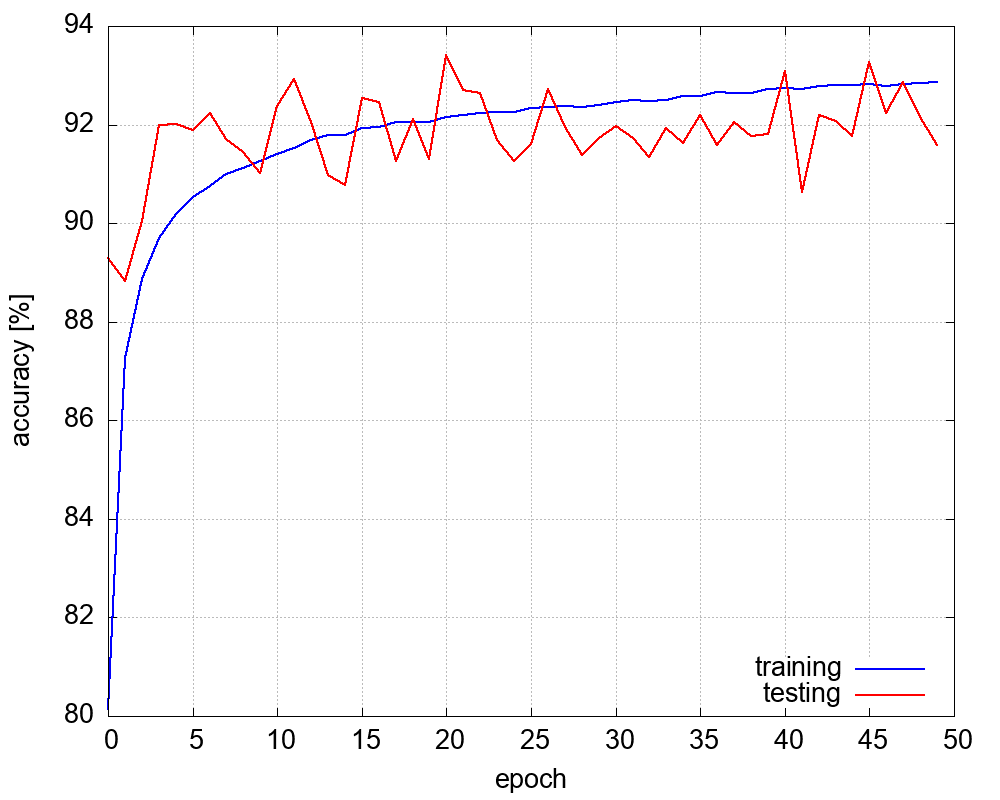

# car detection using magnetic field

class IDs
- 0 : no car or in oposite way
- 1 : car or motorcycle
- 2 : delivery van, less than 3.5t
- 3 : truck, above 3.5t
- 4 : heavy truck


the sensor is streaming 3-axis data of magnetic field :


## dataset notes
time window with length 512 samples, on three axis (XYZ) + padding dummy channel

classes counts : 

class		count		relative[%]
- 0 		 13023 		 56.93
- 1 		 7887 		 34.48
- 2 		 649 		 2.84
- 3 		 479 		 2.09
- 4 		 837 		 3.66


the 20% of items was used for testing, remaining 80% for training + 10x augmentation

some basic preprocessing was used 
- normalisation, each axis independed : x_norm = (x - x.mean())/x.var()
- augmentation : random white noise, random DC offset, random signal center shift

## hyperparameters

- learning rate : cyclic, [0.001, 0.001, 0.0001, 0.0001, 0.0001, 0.00001, 0.00001]
- weight decay  : learning_rate*0.001
- epoch count : 50
- batch size  : 64
- dropout     : 1%


## net_0


- pytorch model   [model.py](models/net_0/model.py)
- pytorch weights [model.pt](models/net_0/trained)
- embedded export float [export_float](models/net_0/export_float)
- embedded export int8 [export_int8](models/net_0/export_int8)
- for embedded run use **/embedded_inference/libs_embedded_neural_network**
- best model result [best.log](models/net_0/result/best.log)
- **need multiply input by x64** for int8 quantized

### architecture

```python
nn.Conv1d(4, 8, kernel_size = 8, stride = 4, padding = 0),
nn.ReLU(), 

nn.Conv1d(8, 16, kernel_size = 8, stride = 4, padding = 0),
nn.ReLU(), 

nn.Conv1d(16, 32, kernel_size = 8, stride = 4, padding = 0),
nn.ReLU(), 

nn.Flatten(), 
nn.Dropout(p=0.01),
nn.Linear(6*32, 5)
```

### training progress
note - training data are heavily noised, that's why training set have higher loss


### exported **float32** result

```
accuracy   = 91.644 [%]
hit_count  = 1349
miss_count = 123

class_accuracy = 97.821%   82.103%   75.0%   85.714%   90.265%   


confusion_matrix = 
         808           4           0           0           0
           4         367           5           1           0
           0          39          42           0           5
           5          28           8          30           5
           8           8           0           3         102
```

### exported quantized **int8** result

```
accuracy   = 78.601 [%]
hit_count  = 1157
miss_count = 315

class_accuracy = 98.71%   39.48%   31.111%   73.171%   90.435%   


confusion_matrix = 
         842          11           2           0           0
           0         167           4           0           0
           0          71          14           6           4
           6         158          24          30           6
           4          15           0           4         104

```


## net_1

- pytorch model   [model.py](models/net_1/model.py)
- pytorch weights [model.pt](models/net_1/trained)
- embedded export float [export_float](models/net_1/export_float)
- embedded export int8 [export_int8](models/net_1/export_int8)
- for embedded run use **/embedded_inference/libs_embedded_neural_network**
- best model result [best.log](models/net_1/result/best.log)
- **need multiply input by x64** for int8 quantized


### architecture

```python
nn.Conv1d(4, 16, kernel_size = 8, stride = 4, padding = 0),
nn.ReLU(), 

nn.Conv1d(16, 32, kernel_size = 8, stride = 4, padding = 0),
nn.ReLU(), 

nn.Conv1d(32, 64, kernel_size = 8, stride = 4, padding = 0),
nn.ReLU(), 

nn.Flatten(), 
nn.Dropout(p=0.01),
nn.Linear(6*64, 5)
```

### training progress
note - training data are heavily noised, that's why training set have higher loss





### exported **float32** result

```
accuracy   = 95.584 [%]
hit_count  = 1407
miss_count = 65

class_accuracy = 98.817%   88.107%   87.273%   97.778%   97.5%   


confusion_matrix = 
         835           3           0           0           0
           1         363           4           0           0
           1          29          48           0           1
           1          10           2          44           1
           6           6           0           0         117
```

### exported quantized **int8** result

```
accuracy   = 88.723 [%]
hit_count  = 1306
miss_count = 166

class_accuracy = 98.307%   84.163%   2.041%   8.333%   95.122%   


confusion_matrix = 
         813           9           0           1           1
           1         372          26           8           3
           0           0           1           0           0
           3          13          13           3           1
           9          47           8          23         117
```

