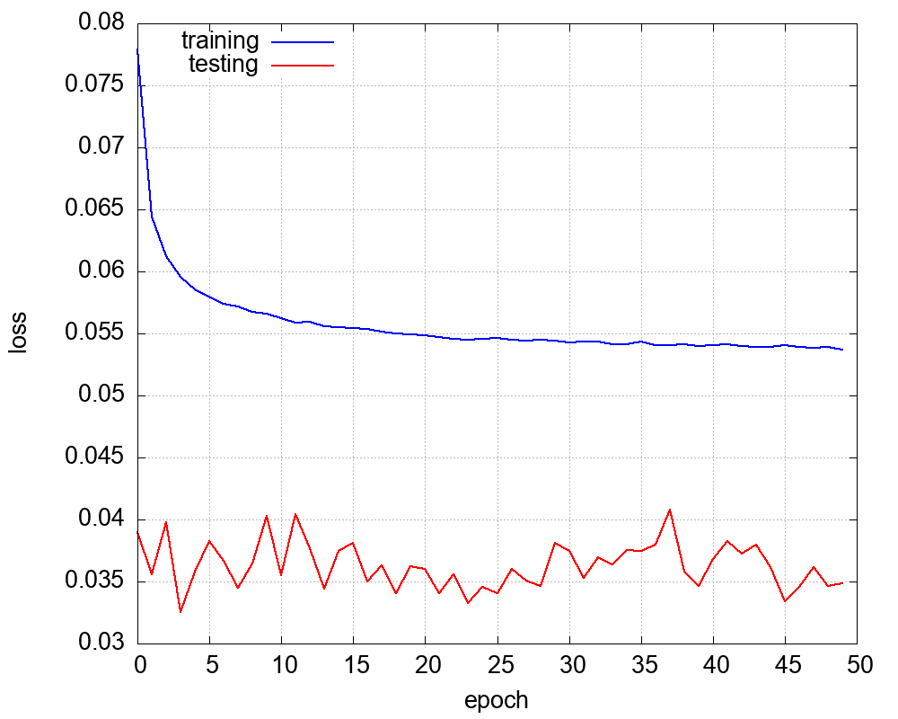
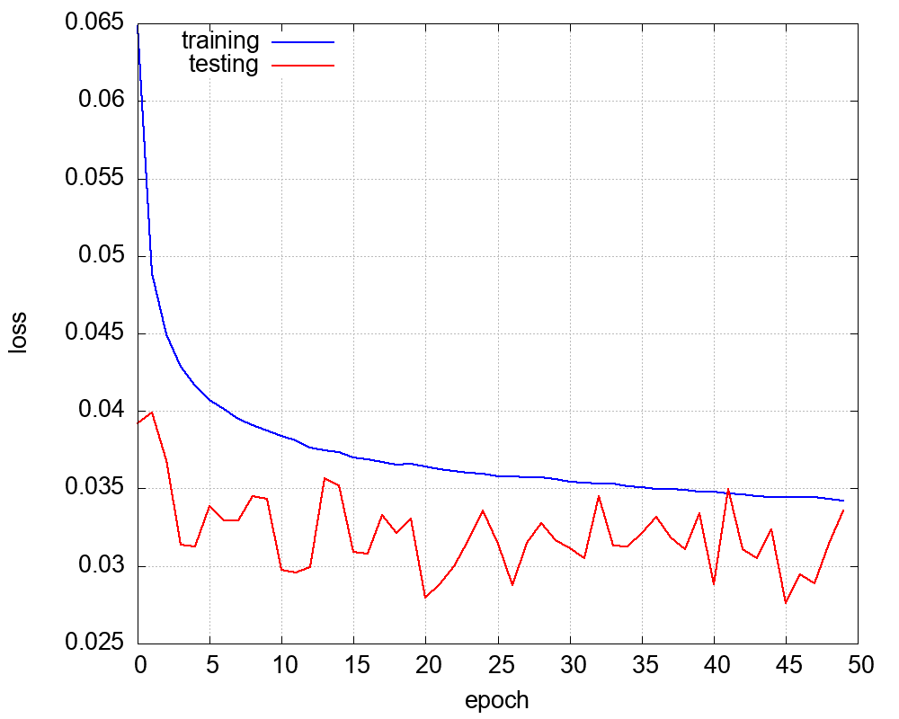
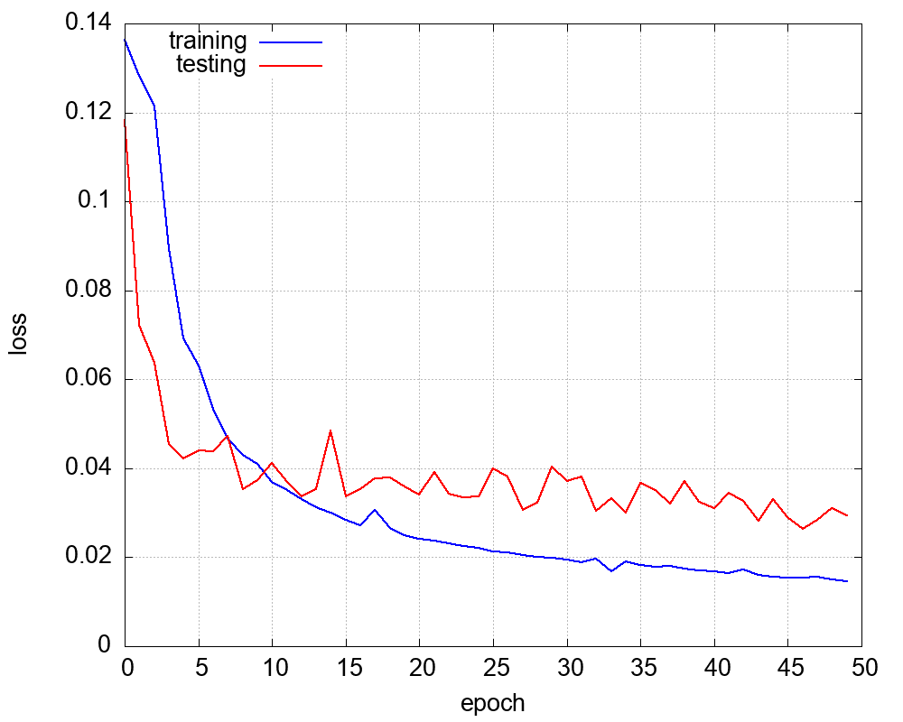
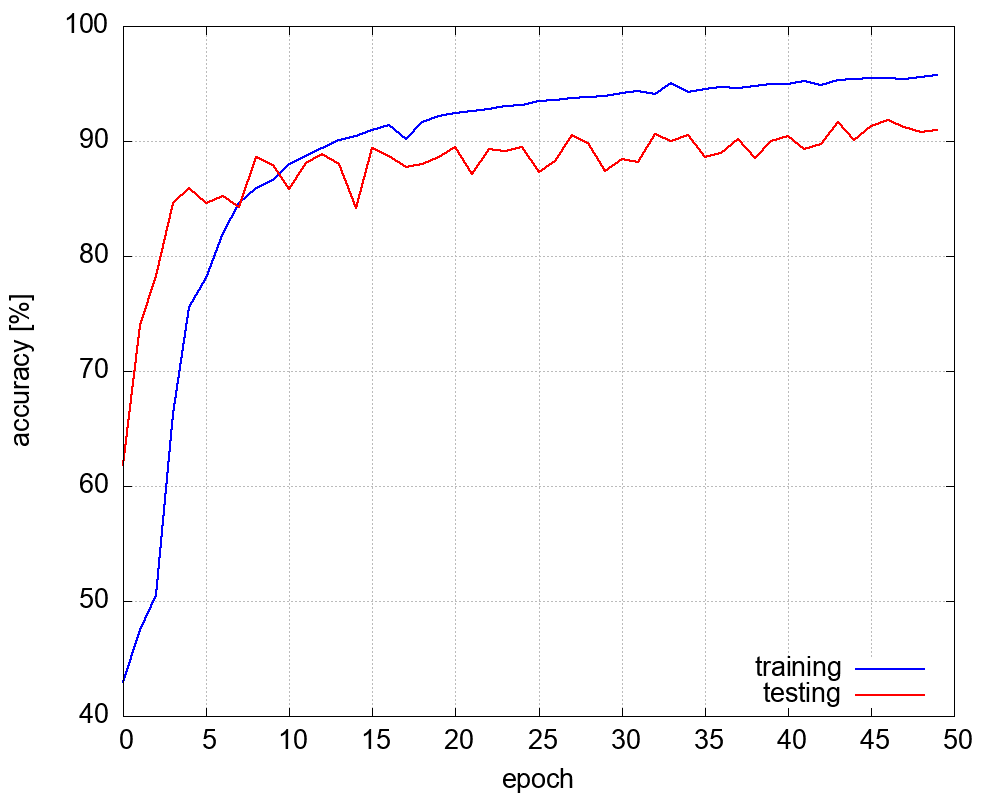
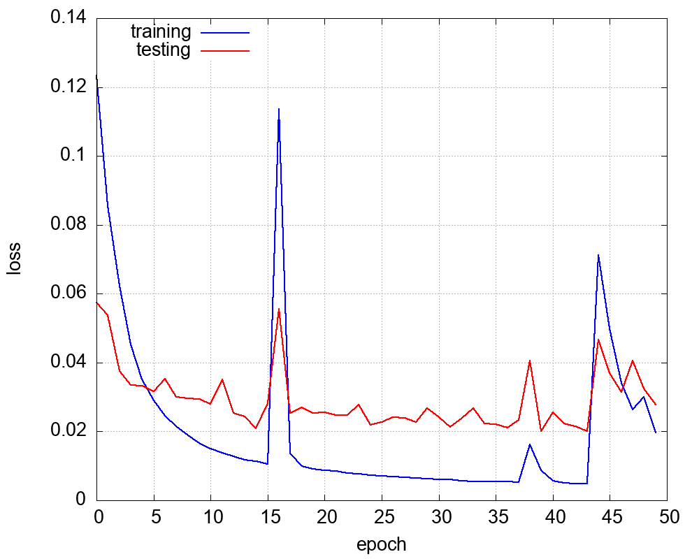
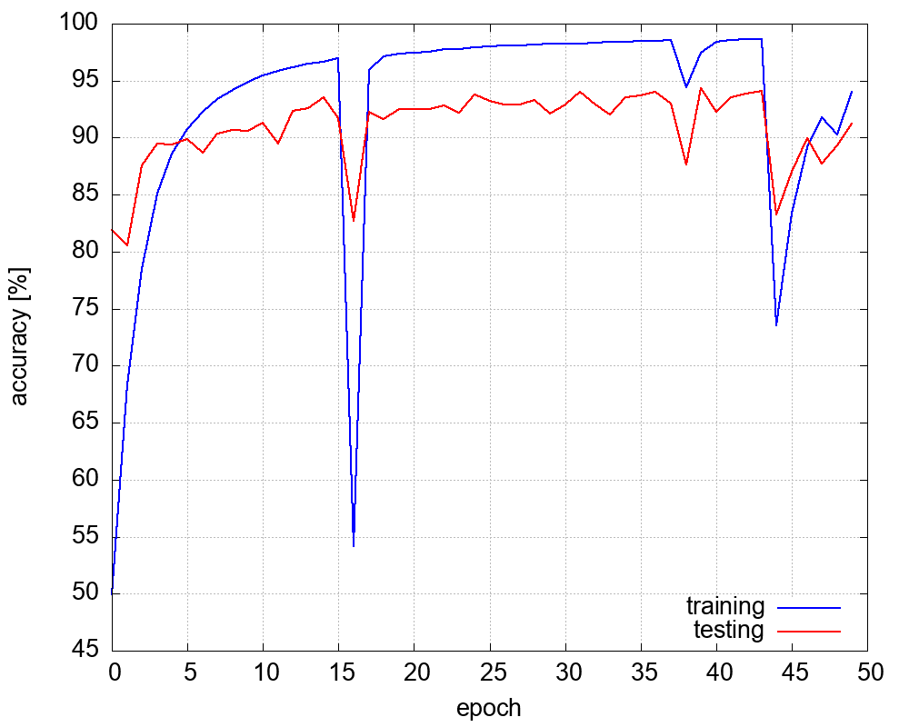
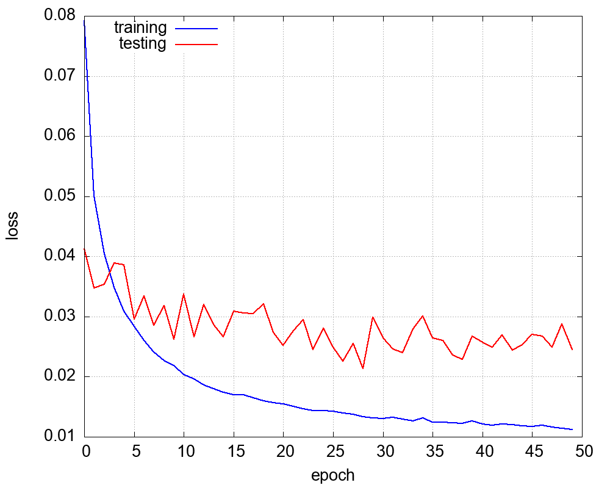
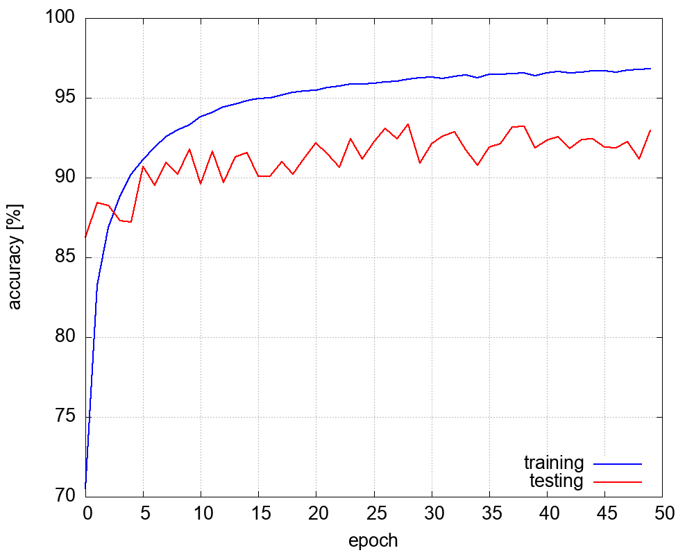
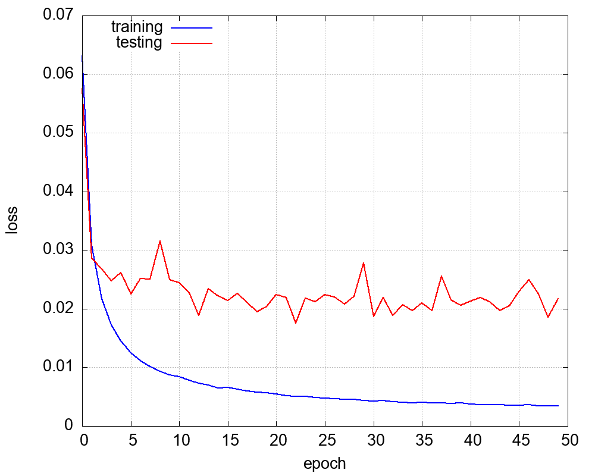

# car detection using magnetic field

class IDs
- 0 : no car or in oposite way
- 1 : car or motorcycle
- 2 : delivery van, less than 3.5t
- 3 : truck, above 3.5t
- 4 : heavy truck


the sensor is streaming 3-axis data of magnetic field :


## dataset notes
time window with length 512 samples, on three axis (XYZ) + padding dummy channel

classes counts : 

class		count		relative[%]
- 0 		 13023 		 56.93
- 1 		 7887 		 34.48
- 2 		 649 		 2.84
- 3 		 479 		 2.09
- 4 		 837 		 3.66


the 20% of items was used for testing, remaining 80% for training + 10x augmentation

some basic preprocessing was used 
- normalisation, each axis independed : x_norm = (x - x.mean())/x.var()
- augmentation : random white noise, random DC offset, random signal center shift

## hyperparameters

- learning rate : cyclic, [0.001, 0.001, 0.0001, 0.0001, 0.0001, 0.00001, 0.00001]
- weight decay  : learning_rate*0.001
- epoch count : 50
- batch size  : 64
- dropout     : 1%


## net_0


- pytorch model   [model.py](models/net_0/model.py)
- pytorch weights [model.pt](models/net_0/trained)
- embedded export float [export_float](models/net_0/export_float)
- embedded export int8 [export_int8](models/net_0/export_int8)
- for embedded run use **/embedded_inference/libs_embedded_neural_network**
- best model result [best.log](models/net_0/result/best.log)
- notes for **embedded int8** usage : input is streched  (normalsied) in range <-127, 127>, axis-wise
- notes for **embedded float** usage : input is streched (normalsied) in range <-1, 1>, axis-wise

### normalisation for int8: 

for each axis x, y, z compute :

- k = (127 - (-127)) / (x.max() - x.min())
- q = 127 - k*x.max()
- x_normalsied = k*x + q

### architecture

```python
nn.Conv1d(4, 8, kernel_size = 8, stride = 4, padding = 0),
nn.ReLU(), 

nn.Conv1d(8, 16, kernel_size = 8, stride = 4, padding = 0),
nn.ReLU(), 

nn.Conv1d(16, 32, kernel_size = 8, stride = 4, padding = 0),
nn.ReLU(), 

nn.Flatten(), 
nn.Dropout(p=0.01),
nn.Linear(6*32, 5)
```

### training progress
note - training data are heavily noised, that's why training set have higher loss




### exported **float32** result

```
accuracy   = 91.168 [%]
hit_count  = 1342
miss_count = 130

class_accuracy = 98.274%   79.128%   90.698%   91.667%   84.173%   


confusion_matrix = 
         797           3           0           0           0
           2         345           2           0           0
           4          58          39           3           2
           4          21           1          44          19
           3           8           0           0         117
```

### exported quantized **int8** result

```
accuracy   = 90.761 [%]
hit_count  = 1336
miss_count = 136

class_accuracy = 98.912%   78.125%   79.545%   95.556%   79.646%   


confusion_matrix = 
         818          11           2           0           3
           0         350           4           0           0
           2          60          35           1           4
           3          21           2          43          15
           3           5           0           0          90

```


## net_1

- pytorch model   [model.py](models/net_1/model.py)
- pytorch weights [model.pt](models/net_1/trained)
- embedded export float [export_float](models/net_1/export_float)
- embedded export int8 [export_int8](models/net_1/export_int8)
- for embedded run use **/embedded_inference/libs_embedded_neural_network**
- best model result [best.log](models/net_1/result/best.log)
- notes for **embedded int8** usage : input is streched  (normalsied) in range <-127, 127>, axis-wise
- notes for **embedded float** usage : input is streched (normalsied) in range <-1, 1>, axis-wise

### normalisation for int8: 

for each axis x, y, z compute :

- k = (127 - (-127)) / (x.max() - x.min())
- q = 127 - k*x.max()
- x_normalsied = k*x + q


### architecture

```python
nn.Conv1d(4, 16, kernel_size = 8, stride = 4, padding = 0),
nn.ReLU(), 

nn.Conv1d(16, 32, kernel_size = 8, stride = 4, padding = 0),
nn.ReLU(), 

nn.Conv1d(32, 64, kernel_size = 8, stride = 4, padding = 0),
nn.ReLU(), 

nn.Flatten(), 
nn.Dropout(p=0.01),
nn.Linear(6*64, 5)
```

### training progress
note - training data are heavily noised, that's why training set have higher loss




### exported **float32** result

```
accuracy   = 93.003 [%]
hit_count  = 1369
miss_count = 103

class_accuracy = 98.568%   79.724%   92.105%   96.429%   97.122%   


confusion_matrix = 
         826           8           0           0           0
           3         346           2           0           0
           1          39          35           0           3
           5          31           0          27           0
           2           9           0           0         135
```

### exported quantized **int8** result

```
accuracy   = 93.478 [%]
hit_count  = 1376
miss_count = 96

class_accuracy = 97.663%   84.828%   86.207%   95.238%   95.349%   


confusion_matrix = 
         794           7           0           0           0
           6         369           4           0           0
           0          30          50           1           2
           7          15           0          40           3
           5          13           3           0         123
```


## net_2

- pytorch model   [model.py](models/net_2/model.py)
- pytorch weights [.pt](models/net_2/trained)
- TODO embedded export float [export_float](models/net_2/export_float)
- TODO embedded export int8 [export_int8](models/net_2/export_int8)
- for embedded run use **/embedded_inference/libs_embedded_neural_network**
- best model result [best.log](models/net_2/result/best.log)
- notes for **embedded int8** usage : input is streched  (normalsied) in range <-127, 127>, axis-wise
- notes for **embedded float** usage : input is streched (normalsied) in range <-1, 1>, axis-wise


### architecture

```python
nn.LSTM(input_size=input_shape[0], hidden_size=64, batch_first=True)
nn.Dropout(p=0.01)
nn.Linear(64, output_shape[0])
```

### training progress
note - training data are heavily noised, that's why training set have higher loss





## net_3

- pytorch model   [model.py](models/net_3/model.py)
- pytorch weights [.pt](models/net_3/trained)
- TODO embedded export float [export_float](models/net_3/export_float)
- TODO embedded export int8 [export_int8](models/net_3/export_int8)
- for embedded run use **/embedded_inference/libs_embedded_neural_network**
- best model result [best.log](models/net_3/result/best.log)
- notes for **embedded int8** usage : input is streched  (normalsied) in range <-127, 127>, axis-wise
- notes for **embedded float** usage : input is streched (normalsied) in range <-1, 1>, axis-wise


### architecture

```python
nn.LSTM(input_size=input_shape[0], hidden_size=128, batch_first=True)
nn.Dropout(p=0.01)
nn.Linear(128, output_shape[0])
```

### training progress
note - training data are heavily noised, that's why training set have higher loss





## net_4

- pytorch model   [model.py](models/net_4/model.py)
- pytorch weights [.pt](models/net_4/trained)
- TODO embedded export float [export_float](models/net_4/export_float)
- TODO embedded export int8 [export_int8](models/net_4/export_int8)
- for embedded run use **/embedded_inference/libs_embedded_neural_network**
- best model result [best.log](models/net_4/result/best.log)
- notes for **embedded int8** usage : input is streched  (normalsied) in range <-127, 127>, axis-wise
- notes for **embedded float** usage : input is streched (normalsied) in range <-1, 1>, axis-wise


### architecture

```python
nn.GRU(input_size=input_shape[0], hidden_size=64, batch_first=True)
nn.Dropout(p=0.01)
nn.Linear(64, output_shape[0])
```

### training progress
note - training data are heavily noised, that's why training set have higher loss





## net_5

- pytorch model   [model.py](models/net_5/model.py)
- pytorch weights [.pt](models/net_5/trained)
- TODO embedded export float [export_float](models/net_5/export_float)
- TODO embedded export int8 [export_int8](models/net_5/export_int8)
- for embedded run use **/embedded_inference/libs_embedded_neural_network**
- best model result [best.log](models/net_5/result/best.log)
- notes for **embedded int8** usage : input is streched  (normalsied) in range <-127, 127>, axis-wise
- notes for **embedded float** usage : input is streched (normalsied) in range <-1, 1>, axis-wise


### architecture

```python
nn.GRU(input_size=input_shape[0], hidden_size=128, batch_first=True)
nn.Dropout(p=0.01)
nn.Linear(128, output_shape[0])
```

### training progress
note - training data are heavily noised, that's why training set have higher loss



